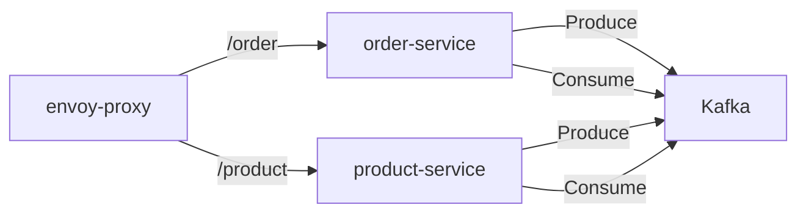

# Kafka Learning Project with Helm and Kubernetes

This project is designed to help users learn Kafka by installing and configuring it using Helm and deploying it on a Kubernetes cluster. The repository contains various Helm charts and templates for deploying Kafka and associated services like Envoy Proxy to connect to product and order services.




## Prerequisites
- Kubernetes cluster
- Helm installed
- kubectl configured

## Installation

### Deploy Kafka
```bash
helm install kafka kafka/kafka
```

### Deploy Order Service
```bash
helm install order order/helm/order
```

### Deploy Product Service
```bash
helm install product product/helm/product
```

### Deploy Envoy Proxy
```bash
helm install envoy envoy/helm
```

**Ensure that the services are up and running**

```bash
kubectl get pods
kubectl get svc
```

## Testing
Test the Kafka producer by sending a message:

Port forward the envoy-proxy service:
```bash
kubectl port-forward svc/envoy-proxy 3000:1000
```

Send a GET message to the order service:
```bash
curl localhost:3000/order/send
```

## How it works

The project uses Helm to deploy Kafka, Envoy Proxy, and the order and product services. The services are connected to Kafka through the Envoy Proxy. The order and product services can produce and consume messages from Kafka.


### kafka.config.ts

```typescript
import { Kafka, logLevel, SASLOptions } from 'kafkajs';

const sasl: SASLOptions = {
  mechanism: 'plain',
  username: 'user1',
  password: 'password1',
};

export const kafkaConfig = {
  clientId: 'order-service',
  brokers: ['kafka.default.svc.cluster.local:9092'],
  logLevel: logLevel.INFO,
  sasl,
};

export const kafka = new Kafka(kafkaConfig);
```


#### kafka-consumer.service.ts

```typescript
import { Injectable, Logger } from '@nestjs/common';
import { kafka } from '../config/kafka.config';

@Injectable()
export class KafkaProducerService {
  private readonly producer = kafka.producer();
  private readonly logger = new Logger(KafkaProducerService.name);

  async connect() {
    try {
      await this.producer.connect();
      this.logger.log('Kafka producer connected');
    } catch (error) {
      this.logger.error('Failed to connect Kafka producer', error);
      throw error;
    }
  }

  async sendMessage(topic: string, messages: any[]) {
    try {
      if (!this.producer) {
        throw new Error('Kafka producer is not initialized');
      }
      await this.producer.send({
        topic,
        messages: messages.map((message) => ({ value: JSON.stringify(message) })),
      });
      this.logger.log('Message sent successfully');
    } catch (error) {
      this.logger.error('Failed to send message', error);
      throw error;
    }
  }
}
```


```typescript
import { Injectable, OnModuleInit, Logger } from '@nestjs/common';
import { kafka } from '../config/kafka.config';

@Injectable()
export class KafkaConsumerService implements OnModuleInit {
  private readonly consumer = kafka.consumer({ groupId: 'order-group' });
  private readonly logger = new Logger(KafkaConsumerService.name);

  async onModuleInit() {
    await this.connect();
  }

  async connect() {
    await this.consumer.connect();
    await this.consumer.subscribe({ topic: 'test-topic', fromBeginning: true });

    await this.consumer.run({
      eachMessage: async ({ topic, partition, message }) => {
        this.logger.log(`Received message: ${message.value.toString()}`);
        // Process the message here
      },
    });
  }
}
```

#### order.controller.ts
```typescript
import { Controller, Get } from '@nestjs/common';
import { KafkaProducerService } from './kafka-producer.service';

@Controller('order')
export class OrderController {
  constructor(private readonly kafkaProducerService: KafkaProducerService) {}

  @Get('send')
  async sendTestMessage() {
    try {
      await this.kafkaProducerService.connect();
      await this.kafkaProducerService.sendMessage('test-topic', [{ key: 'test', value: 'Hello Kafka' }]);
      return 'Message sent';
    } catch (error) {
      return `Failed to send message: ${error.message}`;
    }
  }
}
```

## Conclusion
This project provides a setup for learning Kafka with Helm and Kubernetes. By following the steps above, you can deploy Kafka, Envoy Proxy, and your services, and then test Kafka messaging in a Kubernetes environment.
